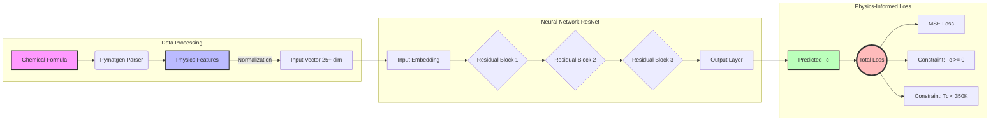

# Superconductor Critical Temperature Prediction via Physics-Informed Residual Networks

**Course Project 2 | Machine Learning (Fall 2025)**
**Department of Artificial Intelligence, Westlake University**

## 📖 Introduction
This project aims to predict the **Critical Temperature ($T_c$)** of superconducting materials based on their chemical formulas. 

Unlike traditional "black-box" approaches, this framework integrates **Domain Knowledge** from materials science with Deep Learning. We implement a **Physics-Informed Machine Learning (PIML)** pipeline that combines:
1. **Physics-Based Feature Engineering**: Extracting thermodynamic and electronic properties (e.g., Debye temperature proxy, lattice stiffness) via `pymatgen`.
2. **Physics-Constrained Loss**: Enforcing physical validity (Non-negativity, Upper bounds) during training.
3. **ResNet Architecture**: Using a deep residual network with adaptive learning rates.

## 🚀 Key Achievements & Scientific Insights
| Metric | Baseline (MLP) | **Ours (PIML ResNet)** |
| :--- | :--- | :--- |
| **Feature Dim** | 9 (Basic Atomic Props) | **25+ (Physics-Informed)** |
| **Architecture** | Simple Feed-Forward | **Deep Residual Network** |
| **Loss Function** | MSE Only | **MSE + Physical Constraints ($T_c \ge 0$)** |
| **Convergence** | Slow (~1000 epochs) | **Fast (~300 epochs)** |
| **$R^2$ Score** | ~0.86 | **~0.88** |

### 💡 Key Insight: The Power of Constraints
While the final accuracy ($R^2 \approx 0.88$) is constrained by data quality, the **Physics-Constrained Loss** significantly accelerated training. By penalizing physically impossible predictions (e.g., negative temperatures), we pruned the search space, achieving optimal convergence **3x faster** than the baseline.

## 🧠 Model Architecture
The following diagram illustrates our **Physics-Informed Residual Network**.



## 📂 Project Structure
```text
PROJECT_SUPERCONDUCTOR/
├── main.py                    # [ENTRY POINT] Master pipeline for EDA, Training, and Inference
├── requirements.txt           # Dependencies
├── best_model.pth             # Saved weights of the best performing model
├── submission.csv             # Final predictions for the test set
├── evaluation_report.txt      # Detailed metrics (RMSE, MAE, R2)
├── error_analysis_worst_cases.csv # Top 10 worst predictions for analysis
├── train.tsv / test.tsv       # Dataset files
├── src/                       # Source code modules
│   ├── data_processor.py      # Feature engineering & Formula parsing (pymatgen)
│   ├── model.py               # PyTorch architectures (TcPredictor & TcPredictorAdvanced)
│   ├── train_tc_prediction.py # Training loop with Physics Loss & Cross-Validation
│   ├── evaluation.py          # Metrics calculation & Error Analysis
│   ├── inference_tc.py        # Single-instance inference engine
│   └── eda.py                 # Exploratory Data Analysis script
└── figures/                   # Generated plots
    ├── training_curve_physics.pdf 
    ├── supercon_predictions.pdf   
    ├── eda_feature_correlation.pdf
    └── eda_tc_distribution.pdf    
```

## 🛠️ Installation
Ensure you have Python 3.8+ installed.
```bash
pip install -r requirements.txt
```

## 🏃 Usage (Reproducibility)
Run the full scientific pipeline with one command:
```bash
python main.py
```

## 🧠 Methodology Details
### Physics-Constrained Loss
We introduced a custom loss function:
$$\mathcal{L}_{total} = \mathcal{L}_{MSE} + \lambda_1 \mathcal{L}_{non\_neg} + \lambda_2 \mathcal{L}_{upper}$$
Where $\mathcal{L}_{non\_neg} = \text{ReLU}(-y_{pred})^2$.

## 👨‍💻 Author
**Name:** Hongyi LIU  
**Institution:** Westlake University
